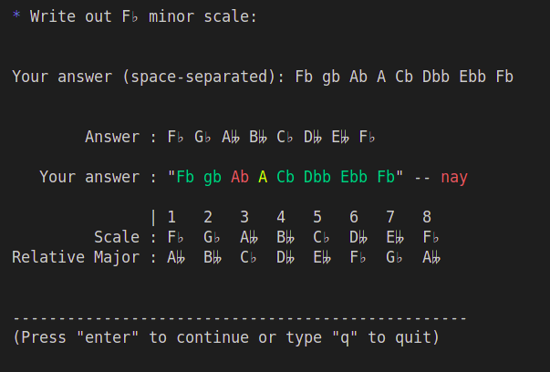
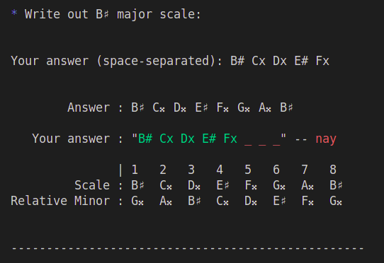
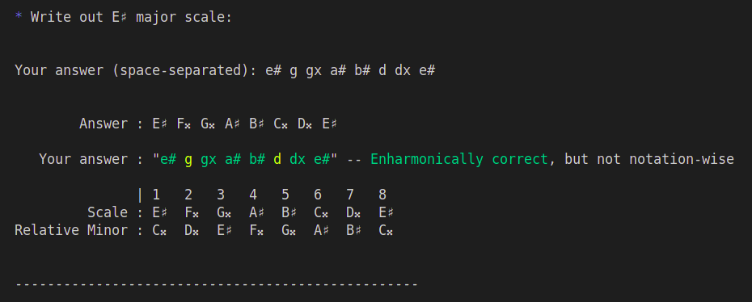

# muz.lisp

An anki-like terminal program for learning music theory.

Right now the script is useful primarily for learning scales and tones. This helps build intuition when you are playing formulaically, to make the response to "ok, now I want to play 4th tone of G♯ major scale" immediate.

## Usage

```bash
$ muz [<options>]
```

```text
Options:

-s    - Replaces UTF-8 symbols such as "♯" and "♭" with simplified
        alternatives such as "#" and "b".

-c    - Prints out a cheat sheet for major and minor scales.

-a    - Specifies how many alternative notations should be printed for
        each scale if `-c` flag is used [default: 2].
```

## Prerequisites

* SBCL

* Quicklisp

## Installation

Clone the repo:

```bash
$ git clone https://github.com/endvvell/muz.lisp.git
```

While in the directory of the project, run:

```bash
$ make
```

The resulting binary will be compiled into the `bin/` directory.

> You can copy the script into a directory that is usually present in your PATH (so you can access it from any directory) and set up a convenient alias for it:

```bash
# might need to run this command as sudo
$ cp ./bin/muz /usr/local/bin/

$ echo "alias muz='/usr/local/bin/muz'" >> ~/.bashrc
```

## Preview

https://github.com/user-attachments/assets/d4da8ee0-a62f-4541-82cd-16a9e355165e







<br/>

---
